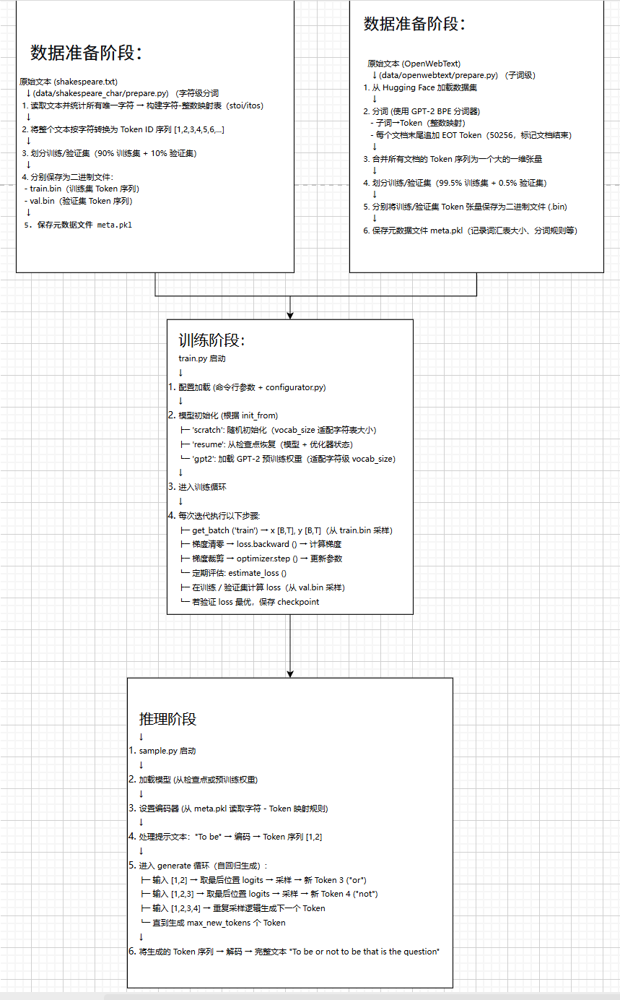

# nanoGPT 核心梳理
1. nanoGPT 目标：根据前文的 token 去预测下一个 token
2. meta.pkl：是一个元数据文件，保存数据集的关键元信息（vocab_size 词汇表大小等）
3. ckpt.pt：训练好的模型检查点
4. nanoGPT 完整覆盖了 数据准备 → 模型训练 → 文本生成 的端到端链路

## 一、核心代码分析
1. 内存映射优化（memmap）：`data = np.memmap(os.path.join(data_dir, 'train.bin'), dtype=np.uint16, mode='r')`
memmap 是 numpy 的内存映射机制，把磁盘文件当作虚拟数组，访问时才读取对应位置的字节，而非全量加载。避免将 OpenWebText 数据集一次性加载到内存，仅在读取时映射文件地址，按需加载数据片段。

2. GPU 训练效率优化（pin_memory）：`x, y = x.pin_memory().to(device, non_blocking=True), y.pin_memory().to(device, non_blocking=True)`
最大化 GPU 训练效率，减少数据从 CPU 到 GPU 的传输耗时。pin_memory()：锁定 CPU 内存（不被系统换出到硬盘），GPU 可直接 DMA 读取，无需 CPU 中转；non_blocking=True：数据传输与 GPU 计算并行（GPU 算前一轮，CPU 传下一轮数据）。

3. 自回归掩码实现（下三角矩阵）：`self.register_buffer("bias", torch.tril(torch.ones(config.block_size, config.block_size)).view(1, 1, config.block_size, config.block_size))`
生成「下三角矩阵掩码」，强制模型在生成时只能看到当前及之前的 Token，看不到后文（GPT 自回归的核心）。

4. 梯度累积（大批次模拟）：`loss = loss / gradient_accumulation_steps` `scaler.scale(loss).backward()`
用小批次模拟大批次训练，解决 GPU/CPU 显存 / 内存不足的问题。

5. 上下文长度适配：`if block_size < model.config.block_size:` `model.crop_block_size(block_size)` `model_args['block_size'] = block_size`
让预训练模型适配更小的上下文长度（CPU环境必用）

6. 位置编码（Token 顺序建模）：`self.pos_emb = nn.Embedding(config.block_size, config.n_embd)` `self.register_buffer("pos_enc", self._get_sinusoid_encoding_table(config.block_size, config.n_embd))`
Transformer 本身是无序的（注意力不区分 token 顺序），位置编码给每个 token 打上位置标签，让模型知道文字的先后顺序。

## 二、Transformer 框架核心梳理
1. 基础架构（论文原版）
Transformer 是基于自注意力机制的序列建模架构，核心由编码器（Encoder）+ 解码器（Decoder）组成：
- Encoder：由 N 层「多头自注意力 + 前馈网络」堆叠，主打双向注意力（能看到整个输入序列），用于理解输入文本的语义；
- Decoder：由 N 层「掩码多头自注意力 + 编码器 - 解码器注意力 + 前馈网络」堆叠，主打单向掩码注意力（只能看到当前及之前的 token），用于自回归生成；
- 核心设计：位置编码（弥补无顺序建模能力）、残差连接 + LayerNorm（稳定训练）、多头注意力（多维度捕捉语义）。

2. GPT 系对 Transformer 的简化（核心差异）
GPT 系列仅保留 Transformer 的 Decoder 部分，并做了关键调整：
- 移除 Encoder 和解码器的「编码器-解码器注意力层」，仅保留掩码自注意力；
- 用「BPE/ 字符级编码」替代原始 Token 编码；
- 训练目标简化为「自回归语言建模」（仅预测下一个 token）。